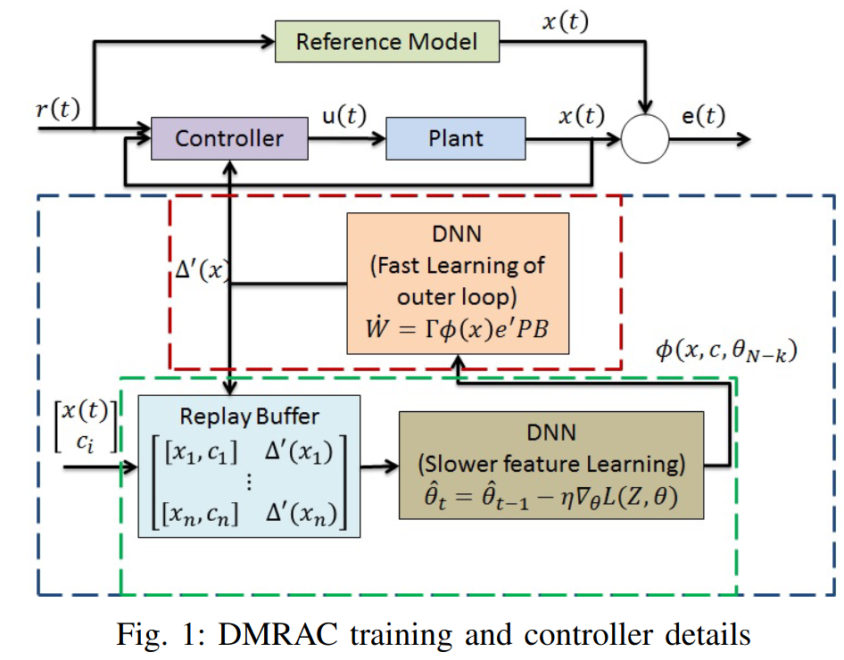
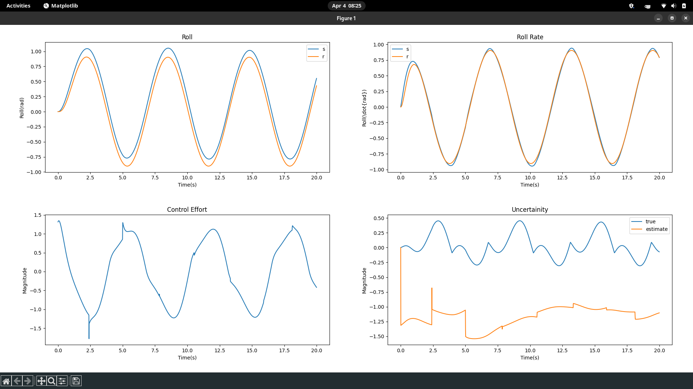

## DeepMRAC
This is Deep Model Reference Adaptive Controller implementation applied on WingRock System Dynamics. 
- This system is simulated in python using euler integration. 
- It utilizes pyTorch for NN implementation, to approximate basis functions for spanning model nonlinearities.
- DMRAC is a adaptive control technique, to actuate systems with the uncertainity on the parametric value while ensuring boundedness properties 
- Ensuring boundedness properties enables the controlled to be applied for real-time safety critical scenario(s).

#### Simulation Architecture

#### Sim. Results

- [Main Paper](https://arxiv.org/abs/1909.08602)
- [Singular Value Maximizing Buffer](https://ieeexplore.ieee.org/document/5991481)
- [Generative Network](https://ieeexplore.ieee.org/document/8619431)

